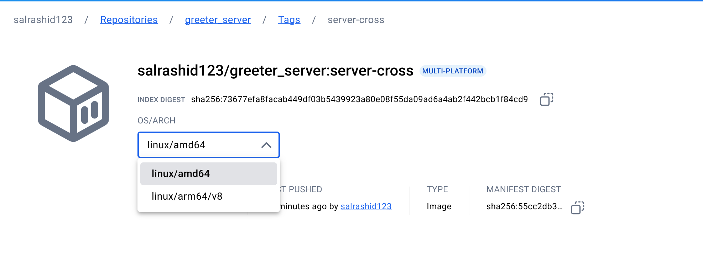
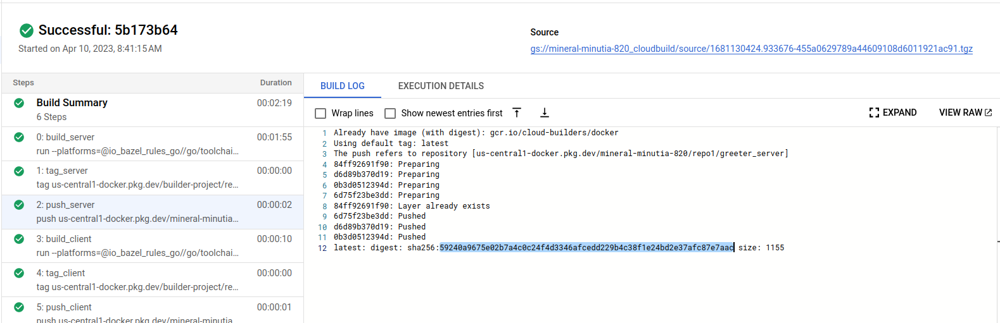

# Deterministic builds with go + bazel + grpc + docker

Deterministic container images for gRPC+golang [bazel](https://bazel.build/).

The following sample will build a golang gRPC client/server and then embed the binaries into container images.

These images are will have a consistent image hash no matter where it is built

*  `greeter_server@sha256:967daccf85fb1979957e502871e8620d443ee7de5272006e2f504ee26b51f561`
*  `greeter_client@sha256:ff1d97fae3f329a0f0b7f054826285acf2f3e5b15f024b0cdde74b11a52f3d1e`

For reference, see:

- [Building deterministic Docker images with Bazel](https://blog.bazel.build/2015/07/28/docker_build.html)
- [Create Container images with Bazel](https://dev.to/schoren/create-container-images-with-bazel-47am)
- [rules_oci](https://github.com/bazel-contrib/rules_oci)
- [Deterministic builds with nodejs + bazel + docker](https://github.com/salrashid123/nodejs-bazel-docker)
- [Deterministic container hashes and container signing using Cosign, Bazel and Google Cloud Build](https://github.com/salrashid123/cosign_bazel_cloud_build)
- [Deterministic container images with java and GCP APIs using bazel](https://github.com/salrashid123/java-bazel-docker)
- [Deterministic container images with python and GCP APIs using bazel](https://github.com/salrashid123/python-bazel-docker)
- [Deterministic container images with c++ and GCP APIs using bazel.](https://github.com/salrashid123/cpp-bazel-docker)
- [Deterministic builds with nodejs + bazel + docker](https://github.com/salrashid123/nodejs-bazel-docker)

To run this sample, you will need `bazel` installed (see [Cloud Shell](#cloud-shell) for an easy way to use `bazel`)

In the end, you'll end up with the same digests

* Server:

```bash
$ docker pull salrashid123/greeter_server:greeter_server_image
$ docker inspect salrashid123/greeter_server:greeter_server_image
```

### With bazel docker container

The easiest way here it to run bazel in docker using the provided image. 

[i know,its weird but the only thing we're using docker here for is for bazel...the build still happens deterministically]

First start a local registry where we can push the test images.  I'm using [crane](https://github.com/google/go-containerregistry/tree/main/cmd/crane)

```bash
go install github.com/google/go-containerregistry/cmd/crane@latest

$HOME/go/bin/crane registry serve --address :4000
```

then

```bash
git clone https://github.com/salrashid123/go-grpc-bazel-docker.git
cd go-grpc-bazel-docker

# to update the repo
# $ bazel version
    # Build label: 8.0.1
    # Build target: @@//src/main/java/com/google/devtools/build/lib/bazel:BazelServer
    # Build time: Fri Jan 17 19:16:16 2025 (1737141376)
    # Build timestamp: 1737141376
    # Build timestamp as int: 1737141376
# bazel run :gazelle -- update-repos -from_file=go.mod -prune=true -to_macro=repositories.bzl%go_repositories
## bazel query 'kind(platform,@rules_go//go/toolchain:all)'
# bazel build --platforms=@rules_go//go/toolchain:linux_amd64 greeter_server:server
# bazel build --platforms=@rules_go//go/toolchain:linux_arm64 greeter_server:server
# bazel run greeter_server:push-image

# server built with bazel 8.0.1
mkdir /tmp/build_output
docker run --net=host \
  -e USER="$(id -u)" \
  -u="$(id -u)"  \
  -v `pwd`:/src/workspace \
  -v $HOME/.docker/config.json:/root/.docker/config.json \
  -v /tmp/build_output:/tmp/build_output \
  -v /var/run/docker.sock:/var/run/docker.sock \
  -w /src/workspace \
  gcr.io/bazel-public/bazel@sha256:352859df4bd128049db770ac4202b79ab425c6fbc41db88eeb79df08a1d1de6f \
  --output_user_root=/tmp/build_output \
  run greeter_server:push-image

# client
# bazel run greeter_client:push-image
docker run --net=host \
  -e USER="$(id -u)" \
  -u="$(id -u)"  \
  -v `pwd`:/src/workspace \
  -v $HOME/.docker/config.json:/root/.docker/config.json \
  -v /tmp/build_output:/tmp/build_output \
  -v /var/run/docker.sock:/var/run/docker.sock \
  -w /src/workspace \
  gcr.io/bazel-public/bazel@sha256:352859df4bd128049db770ac4202b79ab425c6fbc41db88eeb79df08a1d1de6f \
  --output_user_root=/tmp/build_output \
  run greeter_client:push-image

```

### Specify docker image

Specify a docker repo to by setting the `repository` command here. In the case below, its container registry `gcr.io/project_id`

```bazel
oci_image(
    name = "greeter_server_image",
    base = "@distroless_base",
    tars = [":app-tar"],  
    entrypoint = ["/server"],
    cmd = [],
    env = {},
    exposed_ports = [
        "50051/tcp",
    ],    
)

oci_push(
    name = "push-image",
    image = ":greeter_server_image",
    repository = "localhost:4000/greeter_server",
    remote_tags = ["server"]
)
```

### Using Pregenerated protopb and gazelle

The default bazel configuration in `echo/BUILD.bazel` compiles the proto files.  If you would rather use pregenerated proto files (eg, to [avoid conflicts](https://github.com/bazelbuild/rules_go/blob/master/proto/core.rst#avoiding-conflicts), you must do that outside of bazel and just specify a library)

`A)` Generate `proto.pb`:

```bash
/usr/local/bin/protoc -I ./echo  \
  --include_imports --include_source_info \
  --descriptor_set_out=echo/echo.proto.pb \
  --go_opt=paths=source_relative \
  --go_out=plugins=grpc:./echo/ echo/echo.proto
```

`B)` comment the local `replace` directives in `go.mod`:

```
module main

go 1.20

require (
	github.com/golang/protobuf v1.4.3 // indirect
	github.com/google/uuid v1.3.0 // indirect
	golang.org/x/net v0.0.0-20220127200216-cd36cc0744dd // indirect
	golang.org/x/sys v0.0.0-20211216021012-1d35b9e2eb4e // indirect
	golang.org/x/text v0.3.7 // indirect
	google.golang.org/genproto v0.0.0-20200526211855-cb27e3aa2013 // indirect
	google.golang.org/grpc v1.44.0 // indirect
	google.golang.org/protobuf v1.25.0 // indirect
	// github.com/salrashid123/go-grpc-bazel-docker/echo v0.0.0
)

// replace github.com/salrashid123/go-grpc-bazel-docker/echo => ./echo
```


`C)`: Edit `echo/BUILD.bazel`

Enable the rule that uses `echo.pb.go` and disable the rest, set `embed = [":echo_go_proto_gen"]`

```bazel
go_library(
    name = "go_default_library",
    #embed = [":echo_go_proto"],
    embed = [":echo_go_proto_gen"],
    importpath = "echo",
    visibility = ["//visibility:public"],
)

# For pregenerated echo.pb.go
go_library(
    name = "echo_go_proto_gen",
    srcs = [
        "echo.pb.go",
    ],
    importpath = "github.com/salrashid123/go-grpc-bazel-docker/echo",
    visibility = ["//visibility:public"],
    deps = [
        "@com_github_golang_protobuf//proto:go_default_library",
        "@org_golang_google_protobuf//reflect/protoreflect:go_default_library",
        "@org_golang_google_protobuf//runtime/protoimpl:go_default_library",
        "@org_golang_google_grpc//:go_default_library",
        "@org_golang_google_grpc//codes:go_default_library",
        "@org_golang_google_grpc//status:go_default_library",
        "@org_golang_google_grpc//credentials:go_default_library",                         
        "@org_golang_x_net//context:go_default_library",         
    ],
)
```

`D)`  Run `gazelle` to populate dependencies in `repositories.bzl`:

```
bazel run :gazelle -- update-repos -from_file=go.mod -prune=true -to_macro=repositories.bzl%go_repositories
```

### MultiArch OCI Image

The default image built in this repo is of type `format = "oci"` but is not an index pointing to multi-architecture binaries

```bash
$ bazel run greeter_server:push-image

$ crane manifest salrashid123/greeter_server:server | jq '.'
{
  "schemaVersion": 2,
  "mediaType": "application/vnd.oci.image.manifest.v1+json",
  "config": {
    "mediaType": "application/vnd.oci.image.config.v1+json",
    "size": 1871,
    "digest": "sha256:38423e1a284d0aabd8df711d8578ab132ac639b0dab3f0c2111c943ab8541b98"
  },
  "layers": []
}
```

If instead you want to create a OCI image which contains multi-platform/architecture variants, use the `:push-cross-image` targets

For example

```bash
$ bazel run greeter_server:push-image-cross

## which gives the oci image manifest with references to two os/architectures:

$ crane manifest salrashid123/greeter_server:server-cross | jq '.'

{
  "schemaVersion": 2,
  "mediaType": "application/vnd.oci.image.index.v1+json",
  "manifests": [
    {
      "mediaType": "application/vnd.oci.image.manifest.v1+json",
      "size": 2425,
      "digest": "sha256:55cc2db3de0bdafd82e8d019fd87bb918b900a34506f832d6e5f4abdc91d01a7",
      "platform": {
        "os": "linux",
        "architecture": "amd64"
      }
    },
    {
      "mediaType": "application/vnd.oci.image.manifest.v1+json",
      "size": 2425,
      "digest": "sha256:5356edb27d8350cb7e8254873a1249bd4103a67252b577f377206cfdc75fc0e0",
      "platform": {
        "os": "linux",
        "architecture": "arm64",
        "variant": "v8"
      }
    }
  ]
}

## which you can pull if on one of the target
$ docker inspect salrashid123/greeter_server:server-cross

$ crane digest salrashid123/greeter_server:server-cross
   sha256:73677efa8facab449df03b5439923a80e08f55da09ad6a4ab2f442bcb1f84cd9
```



Compare that with the single cpu/os target image

```bash
$ bazel run greeter_server:push-image

$ crane manifest salrashid123/greeter_server:server | jq '.'
{
  "schemaVersion": 2,
  "mediaType": "application/vnd.oci.image.manifest.v1+json",
  "config": {
    "mediaType": "application/vnd.oci.image.config.v1+json",
    "size": 1871,
    "digest": "sha256:ecf986c3337c86c2f65d788e63e174cea1145ce3289527f16b57f0f401ff3827"
  },
  "layers": []
}

$ docker inspect salrashid123/greeter_server:server

$ crane digest salrashid123/greeter_server:server
   sha256:967daccf85fb1979957e502871e8620d443ee7de5272006e2f504ee26b51f561
```



The result of this shows how the images will automatically run on AMD or ARM if the `server-cross` image is used

on AMD

```
$ uname -a
Linux instance-1 5.10.0-32-cloud-amd64 #1 SMP Debian 5.10.223-1 (2024-08-10) x86_64 GNU/Linux

$ docker run salrashid123/greeter_server:server
2025/02/09 12:08:16 Starting server...

$ docker run salrashid123/greeter_server:server-cross
2025/02/09 12:08:20 Starting server...
```

on ARM

```
$ uname -a
Linux instance-1-arm 6.1.0-29-cloud-arm64 #1 SMP Debian 6.1.123-1 (2025-01-02) aarch64 GNU/Linux

$ docker run salrashid123/greeter_server:server
WARNING: The requested image's platform (linux/amd64) does not match the detected host platform (linux/arm64/v8) and no specific platform was requested
exec /server: exec format error

$ docker run salrashid123/greeter_server:server-cross
2025/02/09 12:05:56 Starting server...
```

Finally, if you wanted to generate the plain oci image tarball, run

```bash
$ bazel build greeter_server:tar-oci-index

$skopeo copy --dest-tls-verify=false \
   --all -f oci --preserve-digests oci-archive:bazel-bin/greeter_server/tar-oci-index/tarball.tar \
     docker://localhost:4000/greeter_server:server-cross
```