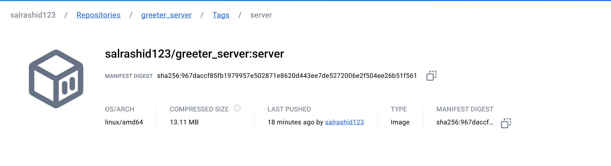

# Deterministic builds with go + bazel + grpc + docker

Deterministic container images for gRPC+golang [bazel](https://bazel.build/).

The following sample will build a golang gRPC client/server and then embed the binaries into container images.

These images are will have a consistent image hash no matter where it is built

*  `greeter_server@sha256:2bd28b0dadb814a0fb8f763b48be928767ff4fc847435b96f43397ae449b9d2f`
*  `greeter_client@sha256:e50b329034d8f43a2d40887c6461c4271f7cc35f7ab5ed583dfc60af16982b56`



and


For reference, see:

- [Building deterministic Docker images with Bazel](https://blog.bazel.build/2015/07/28/docker_build.html)
- [Create Container images with Bazel](https://dev.to/schoren/create-container-images-with-bazel-47am)
- [rules_docker](https://github.com/bazelbuild/rules_docker)
- [Deterministic builds with nodejs + bazel + docker](https://github.com/salrashid123/nodejs-bazel-docker)
- [Deterministic container hashes and container signing using Cosign, Bazel and Google Cloud Build](https://github.com/salrashid123/cosign_bazel_cloud_build)
- [Deterministic container images with java and GCP APIs using bazel](https://github.com/salrashid123/java-bazel-docker)
- [Deterministic container images with python and GCP APIs using bazel](https://github.com/salrashid123/python-bazel-docker)
- [Deterministic container images with c++ and GCP APIs using bazel.](https://github.com/salrashid123/cpp-bazel-docker)
- [Deterministic builds with nodejs + bazel + docker](https://github.com/salrashid123/nodejs-bazel-docker)

To run this sample, you will need `bazel` installed (see [Cloud Shell](#cloud-shell) for an easy way to use `bazel`)

In the end, you'll end up with the same digests

* Server:

```bash
$ docker pull salrashid123/greeter_server:greeter_server_image
$ docker inspect salrashid123/greeter_server:greeter_server_image
```

### With bazel docker container

The easiest way here it to run bazel in docker using the provided image.  I fou

[i know,its weird but the only thing we're using docker here for is for bazel...the build still happens deterministically]

First start a local registry where we can push the test images.  I'm using [crane](https://github.com/google/go-containerregistry/tree/main/cmd/crane)

```bash
crane registry serve --address :4000
```

then

```bash
git clone https://github.com/salrashid123/go-grpc-bazel-docker.git
cd go-grpc-bazel-docker

# server
docker run --net=host \
  -e USER="$(id -u)" \
  -v `pwd`:/src/workspace \
  -v $HOME/.docker/config.json:/root/.docker/config.json \
  -v /tmp/build_output:/tmp/build_output \
  -v /var/run/docker.sock:/var/run/docker.sock \
  -w /src/workspace \
  gcr.io/cloud-builders/bazel@sha256:7c34604572d4f001928b98f2b04e2feaebce67b7933e4182b817dcbfe9904bcd \
  --output_user_root=/tmp/build_output \
  run greeter_server:push-image

# client
docker run --net=host  \
  -e USER="$(id -u)" \
  -v `pwd`:/src/workspace \
  -v $HOME/.docker/config.json:/root/.docker/config.json \  
  -v /tmp/build_output:/tmp/build_output \
  -v /var/run/docker.sock:/var/run/docker.sock \
  -w /src/workspace \
  gcr.io/cloud-builders/bazel@sha256:7c34604572d4f001928b98f2b04e2feaebce67b7933e4182b817dcbfe9904bcd \
  --output_user_root=/tmp/build_output \
  run greeter_client:push-image
```


### Check Image

The output of the commands above will yield 

```bash
docker pull localhost:4000/greeter_server@sha256:2bd28b0dadb814a0fb8f763b48be928767ff4fc847435b96f43397ae449b9d2f
docker pull localhost:4000/greeter_client@sha256:e50b329034d8f43a2d40887c6461c4271f7cc35f7ab5ed583dfc60af16982b56

#docker pull salrashid123/greeter_server@sha256:2bd28b0dadb814a0fb8f763b48be928767ff4fc847435b96f43397ae449b9d2f
#docker pull salrashid123/greeter_client@sha256:e50b329034d8f43a2d40887c6461c4271f7cc35f7ab5ed583dfc60af16982b56
```

Inspect the image thats generated.  The hash we're after is actually `RepoTags` which we'll generate and show later, for now

### (optional) Run the gRPC Client/Server

(why not, you already built it)

- with docker

```bash
docker run -p 50051:50051 localhost:4000/greeter_server@sha256:2bd28b0dadb814a0fb8f763b48be928767ff4fc847435b96f43397ae449b9d2f --grpcport :50051
docker run --network="host" localhost:4000/greeter_client@sha256:e50b329034d8f43a2d40887c6461c4271f7cc35f7ab5ed583dfc60af16982b56 --host localhost:50051 -skipHealthCheck 
```

### Specify docker image

Specify a docker repo to by setting the `repository` command here. In the case below, its container registry `gcr.io/project_id`

```bazel
oci_image(
    name = "greeter_server_image",
    base = "@distroless_base",
    tars = [":app-tar"],  
    entrypoint = ["/server"],
    cmd = [],
    env = {},
    exposed_ports = [
        "50051/tcp",
    ],    
)

oci_push(
    name = "push-image",
    image = ":greeter_server_image",
    repository = "localhost:4000/greeter_server",
    remote_tags = ["server"]
)
```

### Cloud Build

You can use Cloud Build to create the image by using the `bazel` builder and specifying the repository path to export to.  In the sample below, the repository is set to google container registry:

```yaml
oci_push(
    name = "push-image",
    image = ":greeter_server_image",
    #repository = "localhost:4000/greeter_server",
    repository = "us-central1-docker.pkg.dev/$PROJECT_ID/repo1/greeter_server"
    remote_tags = ["server"]
)
```

```bash
$ bazel clean
$ gcloud builds submit --config=cloudbuild.yaml --machine-type=n1-highcpu-32
```
### Using Pregenerated protopb and gazelle

The default bazel configuration in `echo/BUILD.bazel` compiles the proto files.  If you would rather use pregenerated proto files (eg, to [avoid conflicts](https://github.com/bazelbuild/rules_go/blob/master/proto/core.rst#avoiding-conflicts), you must do that outside of bazel and just specify a library)

`A)` Generate `proto.pb`:

```bash
/usr/local/bin/protoc -I ./echo  \
  --include_imports --include_source_info \
  --descriptor_set_out=echo/echo.proto.pb \
  --go_opt=paths=source_relative \
  --go_out=plugins=grpc:./echo/ echo/echo.proto
```

`B)` comment the local `replace` directives in `go.mod`:

```
module main

go 1.20

require (
	github.com/golang/protobuf v1.4.3 // indirect
	github.com/google/uuid v1.3.0 // indirect
	golang.org/x/net v0.0.0-20220127200216-cd36cc0744dd // indirect
	golang.org/x/sys v0.0.0-20211216021012-1d35b9e2eb4e // indirect
	golang.org/x/text v0.3.7 // indirect
	google.golang.org/genproto v0.0.0-20200526211855-cb27e3aa2013 // indirect
	google.golang.org/grpc v1.44.0 // indirect
	google.golang.org/protobuf v1.25.0 // indirect
	// github.com/salrashid123/go-grpc-bazel-docker/echo v0.0.0
)

// replace github.com/salrashid123/go-grpc-bazel-docker/echo => ./echo
```


`C)`: Edit `echo/BUILD.bazel`

Enable the rule that uses `echo.pb.go` and disable the rest:

```bazel
# proto_library(
#     name = "echo_proto",
#     srcs = ["echo.proto"],
#     visibility = ["//visibility:public"],
# )

# go_proto_library(
#     name = "echo_go_proto",
#     compiler = "@io_bazel_rules_go//proto:go_grpc",
#     compilers = ["@io_bazel_rules_go//proto:go_grpc"],
#     importpath = "github.com/salrashid123/go-grpc-bazel-docker/echo",
#     proto = ":echo_proto",
#     visibility = ["//visibility:public"],
# )

# go_library(
#     name = "go_default_library",
#     embed = [":echo_go_proto"],
#     importpath = "echo",
#     visibility = ["//visibility:public"],
# )

go_library(
    name = "echo_go_proto",
    srcs = [
        "echo.pb.go",
    ],
    importpath = "github.com/salrashid123/go-grpc-bazel-docker/echo",
    visibility = ["//visibility:public"],
    deps = [
        "@com_github_golang_protobuf//proto:go_default_library",
        "@org_golang_google_protobuf//reflect/protoreflect:go_default_library",
        "@org_golang_google_protobuf//runtime/protoimpl:go_default_library",
        "@org_golang_google_grpc//:go_default_library",
        "@org_golang_google_grpc//codes:go_default_library",
        "@org_golang_google_grpc//status:go_default_library",
        "@org_golang_google_grpc//credentials:go_default_library",                          
        "@org_golang_x_net//context:go_default_library",         
    ],
)
```

`D)`  Run `gazelle` to populate dependencies in `repositories.bzl`:

```
bazel run :gazelle -- update-repos -from_file=go.mod -prune=true -to_macro=repositories.bzl%go_repositories
```
